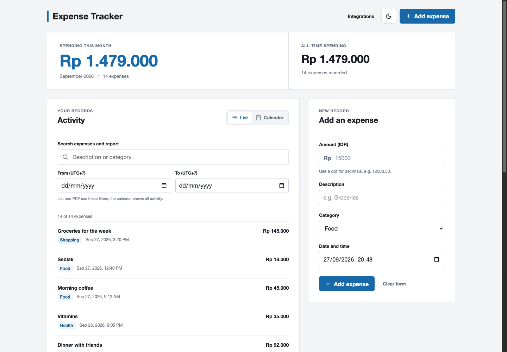
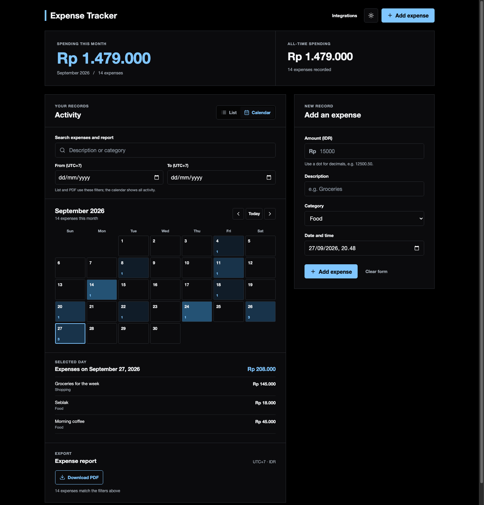
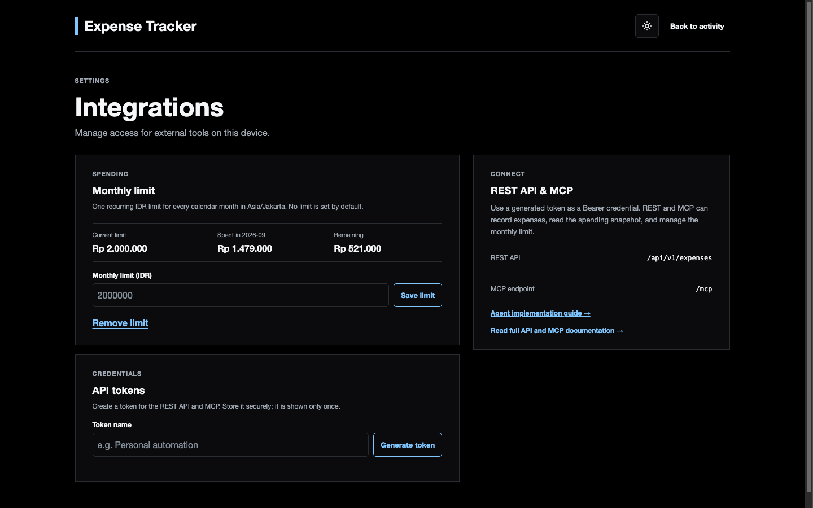
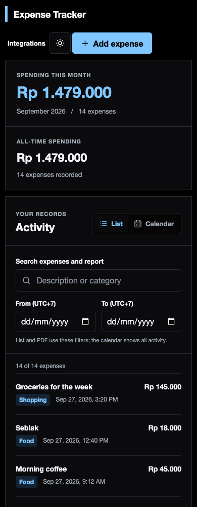

# Expense Tracker

A local-first expense tracker for everyday spending. Record, edit, and delete expenses in a focused web UI, search by description or category, filter by date, explore a calendar, and download a matching PDF. The web UI and external integrations share the same `/api/v1` expense, proof, and budget contracts. Deleting an expense also removes its source mapping and private proof files. An external agent such as Hermes can use the REST API or MCP endpoint to turn chat instructions into user-owned expense changes and verified budget replies.

Attach receipt photos or PDFs as proof to new or existing expenses. Up to three files per expense, 5 MiB each; files stay on this machine.

> Multi-user authentication isolates each account's expenses, proofs, monthly limit, source IDs, and API tokens. The bootstrap administrator is `admin` with temporary password `123456`; the app forces a password change before any financial access. Keep the service private unless you also provide HTTPS and production-grade network controls.

## Preview

These screenshots use **synthetic demo expenses** from September 2026; they are not real financial records.



| OLED calendar and selected day | Integrations and monthly limit |
| --- | --- |
|  |  |



## Run locally

Requires Node.js 20.9+ and npm.

```bash
npm ci
npm run db:init
npm run dev
```

Open <http://localhost:3000>, sign in as `admin` with temporary password `123456`, and replace it when prompted. Administrators can create standard users from the Users page; administrators manage accounts but do not automatically see another user's financial data. SQLite lives at `./data/financial-tracker.db` by default; set `DATABASE_PATH` to use another local file. Proof files live in `proofs/` beside the database; back up both together. Database files, proof files, and local environment files are ignored by Git. To run the production build locally, use `npm run build` and `npm start`.

Each user starts with six categories (`Food`, `Transport`, `Bills`, `Shopping`, `Health`, `Other`) and can create, rename, or delete unused categories on [Integrations](http://localhost:3000/integrations). List search and optional dates filter the downloaded PDF too. Report dates use inclusive Asia/Jakarta (UTC+7) days; the calendar groups records by the browser's local date.

## Connect an LLM agent

Expense Tracker is the **system of record**, not a chat bot or OCR service. The agent owns message intake, interpretation, authorized-user checks, optional photo understanding, and replies. It must write through the API/MCP and use returned numbers—not generate totals itself.

For a message `Seblak 10.000`, a successful agent extracts `Seblak` / `Food` / IDR 10,000, sends `amountCents: 1000000`, and uses the message timestamp converted to ISO UTC. The adapter may include an optional stable `sourceId` when transport metadata is already available; otherwise it omits it and never asks the user. The agent then formats the returned expense ID and budget snapshot as a chat reply.

```text
Chat message → authorized agent → POST /api/v1/expenses or MCP create_expense
                                      ↓
                    { expense, replayed, budget }
                                      ↓
                    Agent formats the confirmed reply
```

Start here:

1. Set a monthly limit on [Integrations](http://localhost:3000/integrations), if wanted. No limit is configured by default.
2. Generate an integration token there and store it in the agent's secret store, or log in through `POST /api/auth/login` and use its short-lived, revocable JWT. Both credentials act only on their user's records. Send `Authorization: Bearer <TOKEN>` to `/api/v1/*` or `/mcp`; never put a token in a URL, prompt, screenshot, log, or commit. The browser keeps its login JWT in an HttpOnly cookie and calls the same `/api/v1` routes.
3. Give the agent the strict [MCP end-to-end specification](docs/mcp-end-to-end.md) and, for adapter implementation, [the Hermes guide](docs/hermes-agent.md). They cover text/photo flows, categories, clarification, retries, and security boundaries.
4. Restrict the chat adapter to authorized senders. Run it on the same device or through a private authenticated connection; app login does not replace HTTPS or network hardening.

### Agent contract at a glance

| Capability | REST | MCP |
| --- | --- | --- |
| Record and get post-write budget snapshot | `POST /api/v1/expenses` | `create_expense` |
| Replace an expense and recalculate budget | `PATCH /api/v1/expenses/:id` | `update_expense` |
| Permanently delete an expense and proofs | `DELETE /api/v1/expenses/:id` | `delete_expense` |
| Attach, list, and read receipt proof | `/api/v1/expenses/:id/proofs` | `attach_expense_proof`, `list_expense_proofs`, `get_expense_proof` |
| Search and list | `GET /api/v1/expenses?q=&from=&to=` | `list_expenses` |
| Read daily/monthly spending and limit | `GET /api/v1/budget?date=YYYY-MM-DD` | `budget_status` |
| Set or clear recurring limit | `PUT /api/v1/budget` | `set_monthly_limit` |
| List and manage categories | `/api/v1/categories` | `list_categories`, `create_category`, `update_category`, `delete_category` |
| Category summary and PDF tool | — | `expense_summary`, `export_report_pdf` |

The REST create and update bodies require positive integer `amountCents` (IDR minor units), non-blank `description`, a supported `category`, and exact UTC `date` (`YYYY-MM-DDTHH:mm:ss.sssZ`). Create accepts an optional stable `sourceId`; update is a full replacement of those four expense fields. Update and delete return the affected expense plus a recalculated `budget`. Delete is permanent and removes source mappings, proof metadata, and private proof files. `budget` includes Jakarta `date`/`month`, `todayCents`, `monthCents`, `monthlyLimitCents`, signed `remainingCents`, and `exceeded`.

For a receipt, upload one file at a time after creating the expense via token-authenticated multipart `POST /api/v1/expenses/:id/proofs`, or use MCP `attach_expense_proof` with base64 bytes. A proof `sourceId` is optional and should come from adapter metadata when available. List metadata and fetch bytes through the respective proof endpoints/tools. No OCR is performed; the agent may interpret a photo itself before recording the expense.

The MCP endpoint is Streamable HTTP at `http://localhost:3000/mcp`, authenticated by a login JWT or generated Bearer token. Expense and category deletion require `confirm: true`. See the [MCP end-to-end specification](docs/mcp-end-to-end.md) and in-app [API & MCP documentation](http://localhost:3000/docs). The browser uses only `/api/v1` data contracts through its HttpOnly JWT cookie, including `GET /api/v1/reports/pdf`.

Rejected MCP tool calls return JSON text with a stable `code`, readable `error`, suggested `hint`, and `requestId`. The same ID is returned in `X-MCP-Request-ID` and written to the finbot server log as a compact `[mcp]` JSON line without request arguments, file bytes, or credentials.

## Development

```bash
npm test
npm run lint
npm run build
```

The app uses Next.js, React, and SQLite via `better-sqlite3`. `npm run db:init` initializes or migrates the local schema without erasing existing expenses. Older date-only records remain readable. `budget_settings` holds the recurring limit; `expense_sources` maps chat source IDs to recorded expenses. Tests use isolated in-memory databases. If you switch Node versions after installing dependencies, reinstall or rebuild the native SQLite module for that runtime.

The web UI uses database-backed sessions. API tokens protect the versioned REST endpoints and MCP and inherit the issuing user's ownership scope. Passwords are scrypt hashes, session and API secrets are stored only as hashes, and five failed logins lock an account for 15 minutes.
